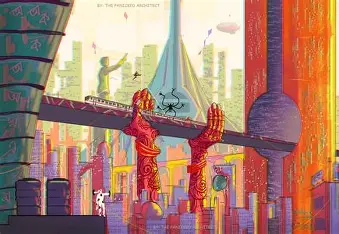
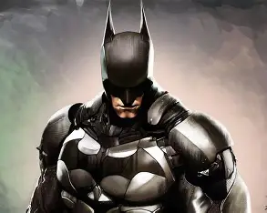
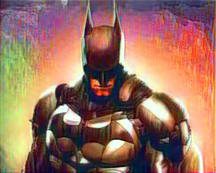

# 🖼️ Neural Style Transfer CV App

[](https://www.python.org/)
[](https://pytorch.org/)
[](https://streamlit.io/)
[](https://github.com/Pranitttt64/Neural-Style-Transfer-CV-App/stargazers)
[](https://github.com/Pranitttt64/Neural-Style-Transfer-CV-App/network/members)
[](https://www.linkedin.com/in/pranit-saundankar/)

---

## 📌 Project Overview
This is a **Neural Style Transfer Web App** built with **PyTorch** and **Streamlit**.  
It allows users to upload an image and apply the artistic style of another image to generate beautiful artistic transformations.

---

## ⚡ Features
- Upload your own **content** and **style** images.
- Apply **Neural Style Transfer** with PyTorch.
- View and download the **stylized output**.
- Simple and interactive **Streamlit UI**.

---

## 🚀 How to Run

### 1️⃣ Clone the repository
```bash
git clone https://github.com/Pranitttt64/Neural-Style-Transfer-CV-App.git
cd Neural-Style-Transfer-CV-App
```

### 2️⃣ Install dependencies
```bash
pip install -r requirements.txt
```

### 3️⃣ Run the app
```bash
streamlit run ST APP.py
```

---

## 📂 Repository Structure
```
├── 1.jpg                 # Example content image
├── 2.jpg                 # Example style image
├── OUTPUT.png            # Generated output example
├── ST APP.py             # Streamlit app code
├── ST JP NB.ipynb        # Jupyter Notebook (Style Transfer)
├── requirements.txt      # Required dependencies
└── README.md             # Project documentation
```

---

## 📸 Example Output
| Content Image | Style Image | Output |
|---------------|------------|--------|
|  |  |  |

---

## 🛠️ Tech Stack
- **Python 3.8+**
- **PyTorch**
- **Streamlit**
- **Computer Vision / Neural Style Transfer**

---

## 📬 Contact
👤 **Pranit Saundankar**  
🔗 [LinkedIn](https://www.linkedin.com/in/pranit-saundankar/)  
📧 *psaundankar64@gmail.com*

---

⭐ If you like this project, don't forget to **star the repo**!
